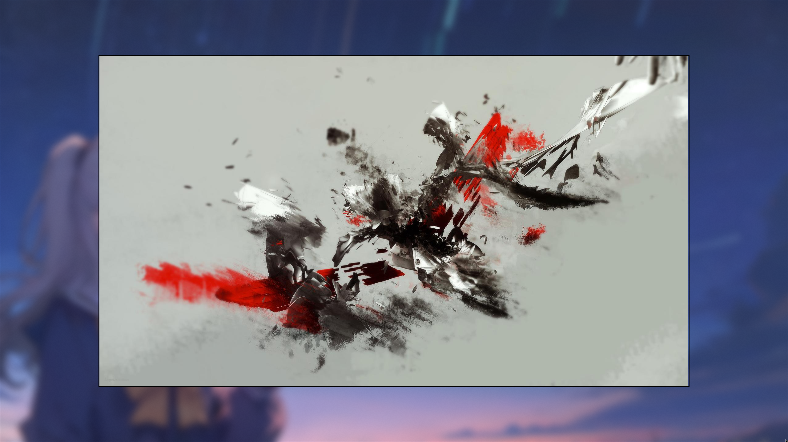
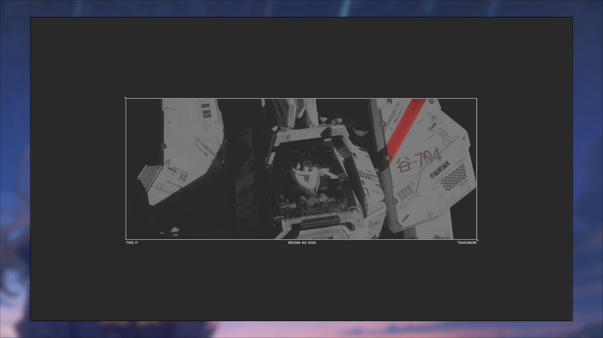

# Lightview

A blazing-fast, minimalist image viewer built with Rust, designed for Hyprland user.

## Design Philosophy

The idea behind Lightview came from using various image viewers on Wayland, each with their own strengths and limitations:

- Swappy has a clean, borderless display (in fullscreen mode) that looks great, but doesn't support navigating between images
- Sxiv offers a minimal viewing experience, but with distracting white/black borders around images
- Eye of GNOME provides useful features but comes with a heavy window decoration that detracts from the viewing experience

Lightview aims to combine the best aspects of these viewers - Swappy's clean display, Sxiv's minimalism, and useful navigation features - while avoiding their limitations. The result is a fast, minimal image viewer that lets you focus entirely on the images.

## Features

- Borderless window that matches image dimensions
- Keyboard navigation between images in the same directory
- Fullscreen mode
- Supports common image formats (JPG, PNG, GIF, WebP, BMP)

## Demo


*Clean, borderless display*


*Fullscreen display*


*Another fullscreen display*

## Requirements

- Rust (latest stable)
- GTK4

## Install

### From AUR (Arch Linux)
```bash
yay -S lightview
```

### From Cargo
```bash
cargo install lightview
```

### From Source
1. Clone the repository:
```bash
git clone https://github.com/ltdt-apex/lightview
cd lightview
```

2. Build and install:
```bash
cargo install --path .
```

Make sure `~/.cargo/bin` is in your PATH:
```bash
# For zsh users
echo 'export PATH="$HOME/.cargo/bin:$PATH"' >> ~/.zshrc
source ~/.zshrc

# For bash users
echo 'export PATH="$HOME/.cargo/bin:$PATH"' >> ~/.bashrc
source ~/.bashrc
```

## Usage

```bash
# View a single image
lightview path/to/image.jpg

# View all images in current directory
lightview .

# View all images in specific directory
lightview path/to/directory
```

### Keyboard Controls

- `Left Arrow`: Previous image
- `Right Arrow`: Next image
- `F`: Toggle fullscreen (gallery mode)
- `Q`: Quit

## Contributing

Pull requests are welcome. For major changes, please open an issue first to discuss what you would like to change.

## License

[MIT](LICENSE)